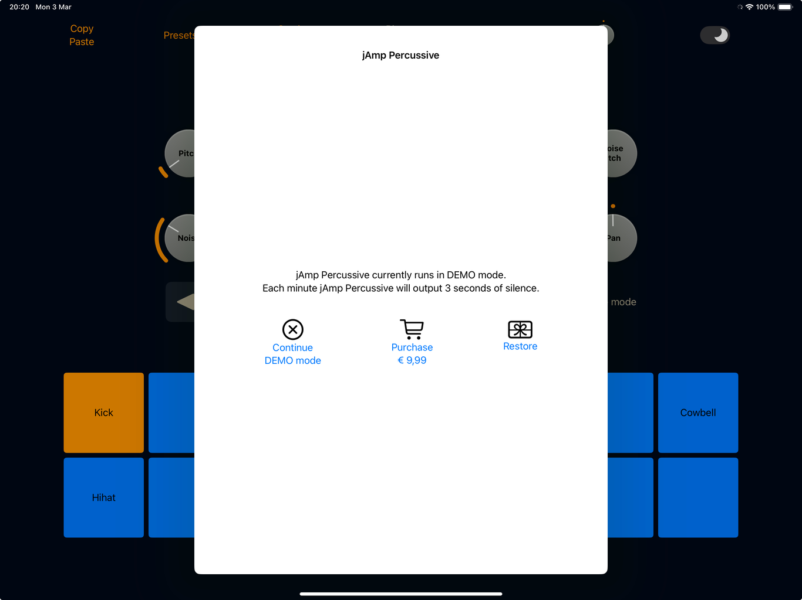
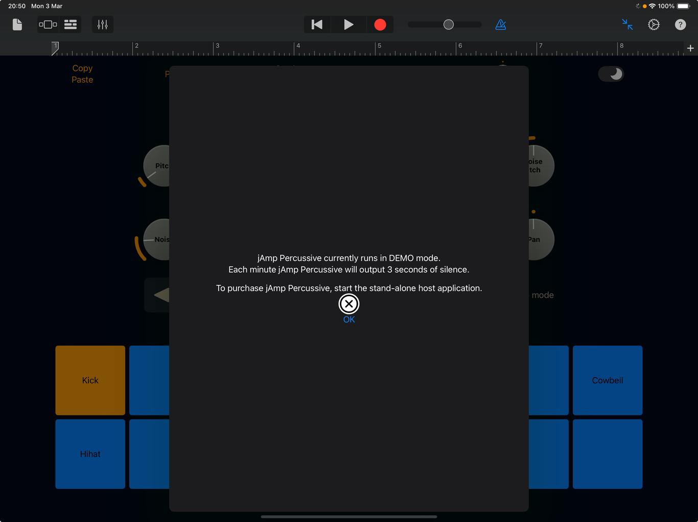
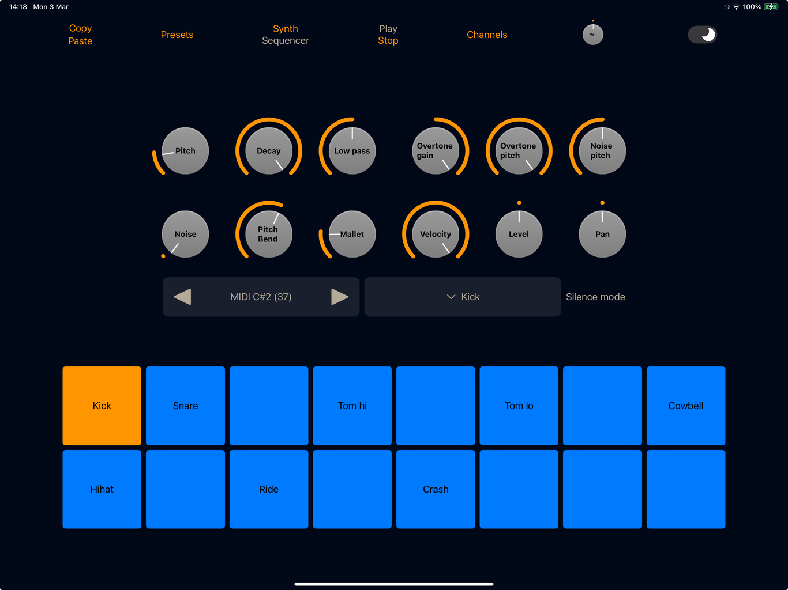
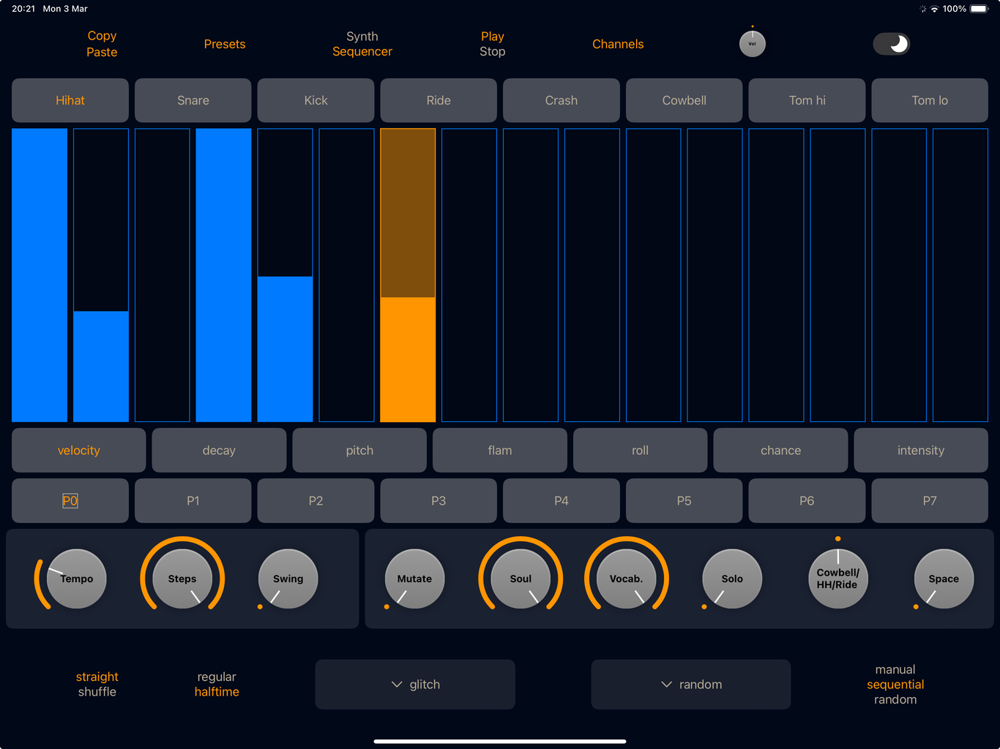
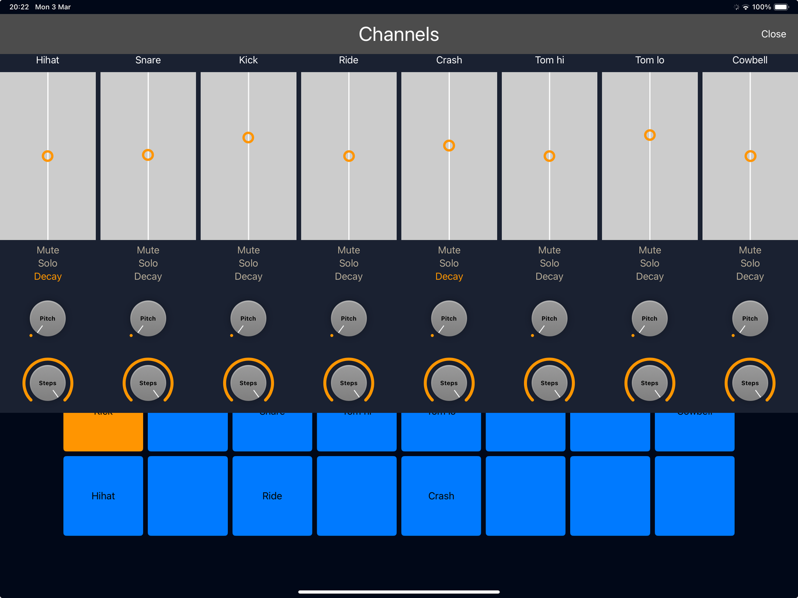
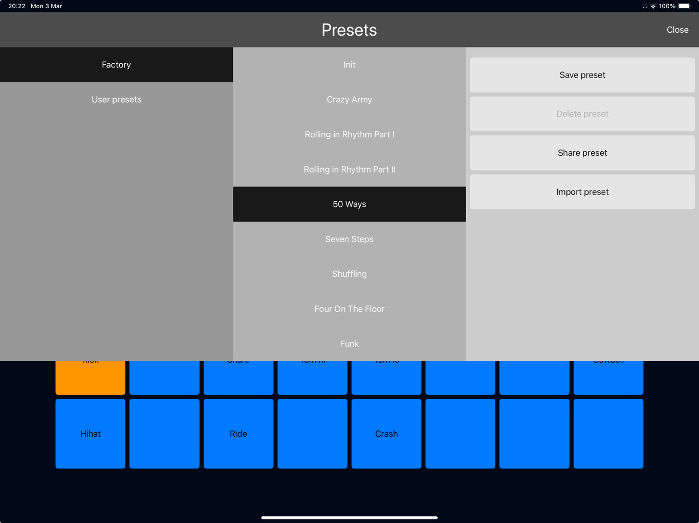

# jAmp Percussive (AUv3) Manual

Welcome to [jAmp Percussive](https://www.jamp-audio.com/percussive.html), a powerful and innovative drum synthesizer and sequencer designed to elevate your music production experience. Unlike traditional drum machines that rely on pre-recorded samples, jAmp Percussive generates drum sounds using advanced physical modeling techniques, allowing for a highly realistic and dynamic sound palette. We harness the power of mathematics to create lifelike drum sounds, offering unparalleled control and flexibility. Whether you're producing intricate rhythms or exploring new sonic territories, jAmp Percussive provides the tools you need to craft unique and expressive drum tracks.

Key features include:

- **Physical Modeling Synthesis**: Generate drum sounds purely through mathematical models, capturing the nuances and characteristics of real drum instruments.
- **Versatile Sequencer**: A built-in sequencer that allows you to create complex and evolving rhythmic patterns with ease.
- **Kits System**: Save and recall complete sound configurations independently from sequencer patterns.
- **Extensive Sound Shaping**: Fine-tune every aspect of your drum sounds with a wide range of parameters and modulation options.
- **Preset Banking**: Organize presets and kits into banks for easy management.
- **MIDI Learn**: Assign MIDI CC controllers to any parameter for hardware integration.
- **Multi-Bus Output**: Route individual drums to separate audio buses for advanced mixing.

This manual will guide you through the installation, setup, and usage of jAmp Percussive, helping you unlock its full potential and integrate it seamlessly into your music production workflow.

---

## Table of Contents

1. [System Requirements](#system-requirements)
2. [Purchase Info](#purchase-info)
3. [Synthesizer View](#synthesizer-view)
4. [16 Large Buttons](#16-large-buttons)
5. [MIDI Step Button](#midi-step-button)
6. [Percussion ID Dropdown](#percussion-id-dropdown)
7. [Silence Mode](#silence-mode)
8. [Membrane-Based Drum Parameters](#membrane-based-drum-parameters)
9. [Cymbal-Based Drum Parameters](#cymbal-based-drum-parameters)
10. [Navigation Bar](#navigation-bar)
11. [Sequencer View](#sequencer-view)
12. [Channels View](#channels-view)
13. [Presets View](#presets-view)
14. [Kits View](#kits-view)
15. [Settings View](#settings-view)
16. [MIDI Configuration](#midi-configuration)
17. [MIDI Out](#midi-out)
18. [Tips & Tricks](#tips--tricks)

---

## System Requirements

jAmp Percussive is an AUv3 (Audio Unit version 3) plugin that can be used as a stand-alone application on iOS and macOS, or as an audio plugin inside a host application on iOS and macOS.

Minimal requirements are:

- iOS 14.0 or later for mobile (iPhone or iPad)
- macOS 11.0 or later for desktop / laptop

The jAmp Percussive software is distributed via the Apple App store. Click on the App store badge to go to the download location.

---

## Purchase Info

Installation of jAmp Percussive is free, but it will run in DEMO mode. This means that every minute jAmp Percussive will output 3 seconds of silence. This allows the user to test the audio plugin in depth before purchasing it.

Purchasing jAmp Percussive is a straightforward and user-friendly process, following the standard steps from the Apple App Store you're likely familiar with. Once the plugin is unlocked, the DEMO mode will be gone, and you can enjoy the full potential.

To start the payment process you have to run jAmp Percussive in stand-alone mode. A popup as in the image above should appear. Simply tap or click on "Purchase" and the Apple App Store will guide you through the process.

Note that you should only pay once to unlock the plugin. In case you have a new device, you can get the plugin unlocked by clicking on "Restore". If you go a second time through the payment system, no worries, Apple will notice this and give you the plugin for free.

Note that it is not possible to purchase the audio plugin via a third-party host application. If you run jAmp Percussive via for instance GarageBand you will get a message as in the image above. Just start the stand-alone jAmp Percussive application if you want to purchase.

---

## Synthesizer View

The main view of the application contains a navigation bar on top, a bunch of knobs that control the synthesized sounds, a row with some additional settings, and 16 large buttons that will produce a drum sound when hit. Let's go over the different buttons and knobs from the bottom of the view to the top.

---

## 16 Large Buttons

The large buttons will produce a drum or cymbal sound when they are tapped, or when the corresponding MIDI note is triggered. There are two types of synthesized sounds available. The 8 top buttons can be used to create membrane based drum sounds, while the bottom 8 buttons are used to create cymbal sounds.

---

## MIDI Step Button

To each button we can assign a MIDI note. Triggering this MIDI note will trigger the corresponding drum or cymbal sound. Use the MIDI Learn functionality in the Settings view to assign specific MIDI notes to each pad.

---

## Percussion ID Dropdown

Each button can be given a percussion ID. This percussion ID will be used by the sequencer (see later). The top 8 buttons, corresponding to membrane based drum sounds, can be given one of the following percussion IDs:

- Kick
- Snare
- Tom lo
- Tom hi
- Cowbell

while the bottom 8 buttons, corresponding to cymbal sounds, can be given the following percussion ids:

- Hihat
- Ride
- Crash

Note that a percussion ID is unique. If a button is given the percussion ID "Hihat", then any other "Hihat" button will become empty.

---

## Silence Mode

This is a tappable button. When activated, the large buttons will not trigger a sound. This is useful when you want to modify the parameters of a drum or cymbal while the sequencer is playing without causing an extra trigger.

---

## Membrane-Based Drum Parameters

### Pitch
Represents the main pitch of the drum sound, in Hertz.

### Decay
Controls the length of resonance of the drum.

### Low Pass
A low pass filter that filters out the higher frequencies.

### Overtone Gain
Controls the inharmonicity of the sound by changing the amount of feedback gain in the underlying all-pass filter.

### Overtone Pitch
Controls the inharmonicity of the sound by changing the frequency in the underlying all-pass filter.

### Noise Pitch
Any noise will first pass through a band-pass filter. This knob controls the frequency range of this band-pass filter.

### Noise
Adds filtered white noise to the sound. Mainly used to simulate a snare.

### Pitch Bend
When triggered, the drum will start at the initial pitch, but will then bend lower. The amount of pitch bend can be controlled with this knob.

### Mallet
Simulates the usage of soft and hard mallets.

### Velocity
Represents the force of a drum trigger.

### Level
Fine-tunes the gain of this drum.

### Pan
Left or right stereo panning.

---

## Cymbal-Based Drum Parameters

### Pitch
Controls the pitch of the cymbal, in steps of half tones. Goes from -24 (or - 2 octaves) to +24 (or + 2 octaves).

### Decay
Controls the length of resonance of the cymbal.

### High pass
A high pass filter that filters out the lower frequencies.

### Timbre
Changes the overall sound of the cymbal.

### Attack
Sets a sharp attacking sound or a slowly increasing build-up of sound.

### Crash delay
This parameter assumes that the "Mallet soft" knob is not fully turned down. The parameter expresses in seconds (0s - 3s) the amount of delay until the cymbal sound "crashes".

### Noise
Controls the amount of filtered white noise.

### Mallet Soft
The initial cymbal trigger can be controlled by this knob. It goes from a pop of white noise to a soft oscillating sine pulse, or anything in between.

### Mallet Pitch
See the previous parameter. This parameter controls the frequency of the soft oscillating sine pulse of the mallet.

### Velocity
Represents the force of a cymbal trigger.

### Level
Fine-tunes the gain of this drum.

### Pan
Left or right stereo panning.

---

## Navigation Bar

At the top of the view is the navigation bar.

### Copy
When in synthesizer view, the copy button will copy the parameters of the current active drum or cymbal. When in sequencer view, the copy button will copy the current sequencer pattern.

### Paste
When in synthesizer view, the current active drum or cymbal will be replaced by the last copied drum or cymbal. When in sequencer view, the current active pattern will be replaced by the last copied pattern.

### Presets
Open the presets view. See [Presets View](#presets-view) for a more detailed description.

### Kits
Open the kits view. See [Kits View](#kits-view) for a more detailed description.

### Synth / Sequencer
Switch between the synthesizer view and the sequencer view.

### Play / Stop
Starts or stops the sequencer.

### Channels
Open the channels view. See [Channels View](#channels-view) for a more detailed description.

### Volume knob
Control the overall volume output.

### Light / Dark mode
Changes the color scheme of the application.

### Randomize (Dice icon)
Randomizes all drum and cymbal parameters to create new and unexpected sounds.

---

## Sequencer View

### Percussion ID Buttons
For each channel or percussion ID (Hihat, Snare, Kick, Ride, Crash, Cowbell, Tom hi, Tom lo) there is a corresponding button which opens the sequencer view for the corresponding drum or cymbal.

### Sequencer Draw Controls
Draw with your finger to program the sequencer for the active channel / percussion ID.

### Parameter Lanes

#### Velocity
Control the velocity of the current active channel / percussion ID by drawing in the sequencer draw controls.

#### Decay
Control the decay parameter of the current active channel / percussion ID by drawing in the sequencer draw controls.

#### Pitch
Control the pitch parameter of the current active channel / percussion ID by drawing in the sequencer draw controls.

#### Flam
Triggers up to 3 ghost notes together with the actual trigger.

#### Roll
Instead of a single trigger, create a "roll" of your drum.

#### Chance
This parameter is relevant when the sequencer is allowed to mutate some of its parameters. The probability that a given sequencer step is allowed to mutate is determined by the "Mutate" knob (see below). This knob sets the percentage of steps that will be mutated (randomly). If the current step will be mutated, there are two mutation scenarios. The first scenario follows the "vocabulary" scenario, where the mutation follows the underlying groove system of jAmp Percussive. The second scenario is the "random" scenario, where the mutation follows the trigger probability set by this "chance" parameter. Whether the "vocabulary" scenario or the "random" scenario is followed depends on the "Vocab." knob (see below). If the current step follows the "random" scenario, the probability that this step will be triggered is given by this "chance" parameter percentage-wise.

#### Intensity
If this step is triggered by the "random" scenario (see "chance" parameter), then the "intensity" parameter sets the target velocity of the trigger. The velocity can still vary due to the "Soul" knob (see below).

### Pattern Buttons
There are 8 patterns available. Select a pattern by tapping the corresponding button.

### Sequencer Control Knobs

#### Tempo
Sets the tempo. When in "straight" mode, 4 sequencer steps account for one beat. When in "shuffle" mode, 3 sequencer steps account for one beat.

#### Steps
Sets the number of steps that make up a full bar. In "straight" mode, the default is 16 steps, and in "shuffle" mode, the default is 12 steps. By modifying the number of steps, interesting polyrhythms can be created. It is also possible to set different steps for different percussion IDs; see the [Channels View](#channels-view) section below.

#### Swing
Delays some of the triggers in order to create a swing feel.

#### Mutate
Sets the probability that a given sequencer step will mutate. There are two mutation scenarios. The first scenario follows the "vocabulary" scenario. This means that the mutation will follow the underlying groove system of jAmp Percussive. The other scenario is the "random" scenario. In that case the mutation will follow the trigger probability that is set by the "chance" parameter for that step.

#### Vocab.
If the current step should mutate, then this parameter controls the probability that the "vocabulary" scenario should be followed. The "vocabulary" scenario means that the mutation will follow the underlying groove system of jAmp Percussive. The other scenario is the "random" scenario. In that case the mutation will follow the trigger probability that is set by the "chance" parameter for that step.

#### Soul
Adds humanization and variation to velocity values, making the performance feel more natural and less mechanical.

#### Solo
In the case that the current step is mutating and following the "Vocabulary" scenario (see "chance" parameter, "mutate" knob, "vocab." knob), the mutation will follow the groove system of jAmp Percussive. This groove system has two modes: normal mode or solo mode. The solo knob determines the probability that normal or solo mode is followed.

#### Cowbell/HH/Ride
If the groove system of jAmp Percussive is followed (see "chance" parameter, "mutate" knob, "vocab." knob), the groove will use a cowbell, or hihat, or ride. With this parameter you can control the instrumentation.

#### Space
If the groove system of jAmp Percussive is followed (see "chance" parameter, "mutate" knob, "vocab." knob), then you can control the spacing or groove density with this parameter.

### Straight / Shuffle
Switch between straight groove and shuffle groove. The switch from straight to shuffle will be made at the end of the current pattern.

### Regular / Halftime
If the groove system of jAmp Percussive is followed (see "chance" parameter, "mutate" knob, "vocab." knob), then the underlying groove system can follow a halftime or a regular groove.

### Glitch / Mutate / Overwrite
Let's assume a given step will be mutated (see "mutate" knob). Then three options are available:

- **Glitch**: the current step is mutated, but the mutation is not stored. So next time we arrive here in the pattern we have the original setting again.
- **Mutate**: the current step is mutated, and the system remembers the mutation, but the mutation is not written in the sequencer. Next time we arrive here in the pattern, we hear the mutation again. But the sequencer still remembers our original setting.
- **Overwrite**: the current step is mutated, and the mutation is written in the sequencer.

### Solo Groove Dropdown
In the case that the current step is mutating and following the "Vocabulary" scenario (see "chance" parameter, "mutate" knob, "vocab." knob), the mutation will follow the groove system of jAmp Percussive. This groove system has two modes: normal mode or solo mode (see "solo" knob). In case we follow the solo mode, there are a couple of solo grooves that can be selected. Select any of the grooves from the dropdown to hear the differences (assuming that the mutate knob is not 0, that the vocab knob is not 0, and that the solo knob is not 0).

### Sync / No Sync
This button only appears when jAmp Percussive is running as AUv3 in a host DAW that supports a transport layer. If syncing is turned on, the tempo will be determined by the tempo marker that is provided by the host application. If off, the tempo is controlled by jAmp Percussive's own tempo knob.

### Manual / Sequential / Random
- **Manual**: play patterns in manual mode. The pattern that is currently active will be played.
- **Sequential**: play patterns sequentially.
- **Random**: play patterns in random order.

---

## Channels View

The Channels view provides mixing controls for each of the 8 sequencer lanes (with each lane corresponding to a percussion ID).

### Volume / Pan Rectangle
The Channels view lets you easily change the volume and panning of the 8 sequencer lanes. Drag horizontally for pan, vertically for volume.

### Mute
Mute this channel.

### Solo
Only play this channel, and mute all the other channels.

### Decay
When mutating (see "mutate" knob), allow the mutation to change the decay parameter.

### Pitch
When mutating (see "mutate" knob), allow the mutation to change the pitch parameter. Set to 0 if no pitch should be changed. Increment to allow for more pitch changes.

### Steps
There is a general Steps knob that controls the steps for one bar in general. However, here the number of steps for a given channel can be controlled separately so that polyrhythms can be created.

---

## Presets View

Browse through the factory presets, or create your own presets. Presets store **both** the sound parameters (all drum/cymbal settings) **and** the sequencer patterns.

### Factory vs User Presets
- **Factory**: Pre-made presets that come with jAmp Percussive. These cannot be deleted or modified.
- **User Presets**: Your own saved presets that you can create, modify, and delete.

### Preset Banking
Presets can be organized into banks using a naming convention. To assign a preset to a bank, use the format `BankName: PresetName` when saving. For example:
- `Jazz: Brushes` - Places the preset "Brushes" in the "Jazz" bank
- `Electronic: 808 Vibes` - Places the preset "808 Vibes" in the "Electronic" bank

When saving a preset, you can:
1. Select an existing bank from the dropdown
2. Choose "+ New Bank" to create a new bank
3. Leave as "Uncategorized" for no bank assignment

Banks can be expanded/collapsed by tapping on the bank header.

### Save Preset
Save your current state as a user preset by entering a name. If the name you enter is colored red, you are about to overwrite an existing user preset.

### Delete Preset
Deletes the selected preset. Factory presets cannot be deleted.

### Delete Many
Opens a view where you can delete multiple presets at once. Presets are organized by bank, and you can tap the trash icon next to any preset to delete it, or swipe to delete.

### Share Preset
Exports the selected preset so that it can be shared with other people. The preset is exported as a `.prc` file.

### Export All
Exports all presets (both factory and user) as a zip file for backup purposes.

### Import Preset
Import any preset that was shared with you. Accepts `.prc` files.

---

## Kits View

The Kits view allows you to save and recall **only the sound parameters** (drum and cymbal settings) independently from the sequencer patterns. This is useful when you want to:
- Use the same drum sounds with different sequencer patterns
- Quickly swap out all drum sounds while keeping your rhythm intact
- Build a library of drum sound collections

### Understanding Presets vs Kits

| Feature | Presets | Kits |
|---------|---------|------|
| Saves sound parameters | ‚úì | ‚úì |
| Saves sequencer patterns | ‚úì | ‚úó |
| Saves mixer settings | ‚úì | ‚úó |

### Factory vs User Kits
- **Factory**: Pre-made kits that come with jAmp Percussive (ElectroKit, FunkKit, JazzKit, TechnoKit, TribalKit, etc.). These cannot be deleted or modified.
- **User Kits**: Your own saved kits that you can create, modify, and delete.

### Kit Banking
Like presets, kits can be organized into banks using the format `BankName: KitName`. For example:
- `Acoustic: Studio Kit` - Places the kit "Studio Kit" in the "Acoustic" bank
- `Electronic: 909 Sounds` - Places the kit "909 Sounds" in the "Electronic" bank

### Save Kit
Save your current drum and cymbal parameters as a user kit.

### Delete Kit
Deletes the selected kit. Factory kits cannot be deleted.

### Delete Many
Opens a view where you can delete multiple kits at once.

### Share Kit
Exports the selected kit so that it can be shared with other people.

### Export All
Exports all kits as a zip file for backup purposes.

### Import Kit
Import any kit that was shared with you.

### Navigating Kits
In the navigation bar, you can use the arrow buttons next to "Kits" to quickly cycle through available kits without opening the Kits view.

---

## Settings View

The Settings view provides access to advanced configuration options.

### General Settings

#### Allow Mixer Override from Preset
When enabled, loading a preset will also load its mixer settings (volume, pan, mute, solo for each channel). When disabled, your current mixer settings will be preserved when loading presets.

#### Appearance (Light/Dark Mode)
Toggle between light and dark color schemes for the user interface.

#### Chromatic Pad MIDI Mode
When disabled, jAmp Percussive responds to all MIDI channels when tapping the corresponding MIDI note for one of the 16 drum pads. By enabling this toggle, the MIDI channels 2-16 will trigger chromatic drum sounds for the respective drum pads 1-15, while MIDI channel 1 will still respond to the MIDI notes of the different drum pads (i.e. the default behaviour). Drum pad 16 can not be triggered chromatically.

#### Open HH
This setting allows you to assign an alternative MIDI note for open hi-hat sounds. There is only one hihat model, and the sound is open or closed depending on the current decay value. By setting an alternative MIDI note, you can send a different signal to an external MIDI receiver when the hihat sound is open or closed.

#### Open HH Threshold
A slider (0-100%) that works in conjunction with the Open HH setting. When the alternative open hi-hat MIDI note is triggered:

- Decay values **at or above** the threshold ? Send **open** hi-hat sound MIDI signal
- Decay values **below** the threshold ? Send **closed** hi-hat sound MIDI signal (the default MIDI value)

### Bus Settings

jAmp Percussive supports multi-bus output, allowing you to route individual drums or groups of drums to separate audio outputs. This is particularly useful when running jAmp Percussive as an AUv3 plugin in a DAW, as it enables independent mixing and processing of each drum.

#### Available Bus Configurations

**Default Bus Settings**
Routes drums by percussion type:
- Bus 1: Master (all drums mixed)
- Bus 2: Hihat
- Bus 3: Snare
- Bus 4: Kick
- Bus 5: Ride
- Bus 6: Crash
- Bus 7: Tom Hi
- Bus 8: Tom Lo
- Bus 9: Cowbell

**Unmixed Bus Settings**
Routes drums to separate buses without the internal mixer applied:
- Bus 1: Master
- Bus 2-9: Individual percussion types (unmixed)

**Pad Bus Settings (16 Pads to 16 Buses)**
Routes each of the 16 pads to its own dedicated bus:
- Bus 1-16: Individual pads

#### Custom Bus Assignment
You can manually assign any pad or percussion type to any of the 16 available buses using the dropdown menus.

---

## MIDI Configuration

jAmp Percussive offers extensive MIDI control capabilities through MIDI Learn functionality.

### Accessing MIDI Settings
Open the Settings view and navigate to the MIDI section. You'll find several categories:

### Patterns
Assign MIDI notes to trigger each of the 8 patterns. Default assignments are:
- Pattern 1: C1 (MIDI note 24)
- Pattern 2: C#1 (MIDI note 25)
- Pattern 3: D1 (MIDI note 26)
- Pattern 4: D#1 (MIDI note 27)
- Pattern 5: E1 (MIDI note 28)
- Pattern 6: F1 (MIDI note 29)
- Pattern 7: F#1 (MIDI note 30)
- Pattern 8: G1 (MIDI note 31)

### Mixer
Assign MIDI CC (Continuous Controller) messages to control mixer parameters for each percussion channel:
- **Mute**: Toggle mute on/off
- **Decay**: Control decay amount
- **Pitch**: Control pitch variation
- **Steps**: Control step count
- **Level**: Control volume
- **Pan**: Control stereo panning

### General
Assign MIDI CC messages to global parameters:
- Volume
- Tempo
- Sync on/off
- Play/Stop
- Steps
- Mutate
- Vocabulary
- Swing
- Soul
- Solo
- Pattern Order
- Hihat/Cowbell/Ride selection
- Space
- Halftime
- Overwrite
- Solo Algorithm

### Drums
Assign MIDI notes and CC messages to individual drum pads and their parameters.

### MIDI Learn Procedure
1. Tap the "Learn" button next to the parameter you want to assign
2. Move the desired MIDI controller (knob, fader, key, etc.) on your MIDI device
3. The assignment will be captured automatically
4. Use "Clear" to remove an existing assignment

---

## MIDI Out

jAmp Percussive sends MIDI output. This means that its sequencer can be used in combination with other audio units. It is for instance possible to trigger samples by combining jAmp Percussive's MIDI output with a sample playing audio unit.

### Use Cases for MIDI Out
- **Layering sounds**: Trigger external samplers or synthesizers alongside jAmp Percussive's internal sounds
- **Recording MIDI**: Capture the sequencer output as MIDI data in your DAW
- **Controlling other instruments**: Use jAmp Percussive's groove system to drive other drum machines or instruments
- **Live performance**: Route MIDI to external hardware synthesizers

### MIDI Note Assignments
Each percussion ID outputs on its corresponding MIDI note when triggered by the sequencer:
- The MIDI notes correspond to the General MIDI drum map
- MIDI velocity reflects the velocity parameter of each step

---

## Tips & Tricks

### Creating Realistic Drum Sounds

1. **Kick drums**: Start with a low pitch (60-100 Hz), moderate decay, and some pitch bend for punch. The mallet parameter can add attack.

2. **Snare drums**: Use moderate pitch, add noise for the snare wires, and experiment with overtone gain for body.

3. **Hi-hats**: Use short decay for closed hats, longer for open. The timbre parameter drastically changes the character.

4. **Toms**: Set different pitches for high and low toms. Add slight pitch bend for a more natural sound.

### Building Interesting Patterns

1. **Use polyrhythms**: Set different step counts for different percussion IDs in the Channels view.

2. **Layer mutations**: Use the mutation system with low probability to add occasional variations.

3. **Combine patterns**: Use Sequential or Random pattern modes to create longer, evolving arrangements.

4. **Copy and modify**: Use Copy/Paste to duplicate patterns, then make small variations.

### Performance Tips

1. **Use Silence Mode**: Enable silence mode when tweaking sounds during playback to avoid accidental triggers.

2. **Quick preset switching**: Use the arrow buttons next to "Presets" for fast preset browsing.

3. **Save often**: Create user presets as you develop sounds you like.

4. **Organize with banks**: Use the banking system to keep your presets and kits organized by style or project.

### Integration with DAWs

1. **Multi-bus mixing**: Set up custom bus assignments to process each drum independently in your DAW.

2. **Tempo sync**: Enable sync when running as an AUv3 to lock to your DAW's tempo.

3. **MIDI recording**: Use MIDI output to record the sequencer as MIDI data for further editing.

4. **Automation**: Use MIDI CC assignments to automate parameters from your DAW.

---

## Support

For support, feature requests, or bug reports, please visit [jamp-audio.com](https://www.jamp-audio.com) or contact us through the App Store.

---

*jAmp Percussive is developed by jAmp Audio. © 2024-2026 All rights reserved.*
