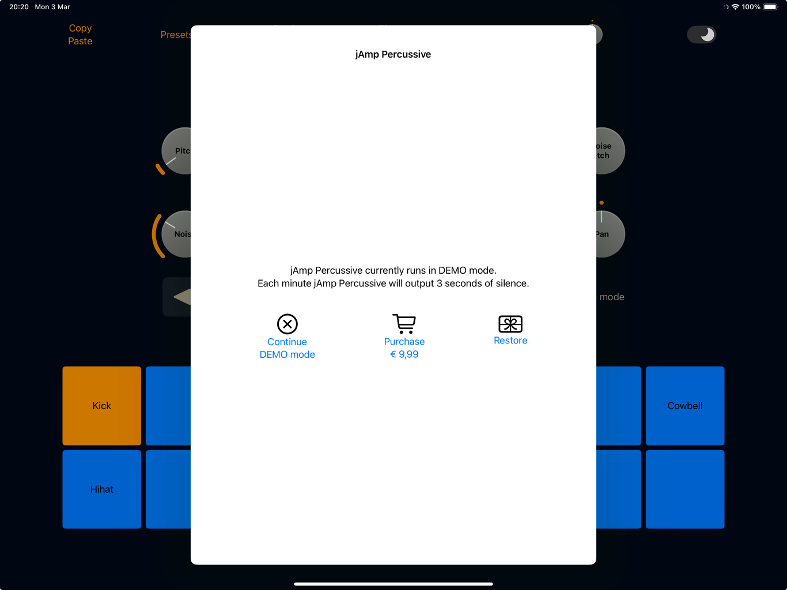

# jAmp Percussive (AUv3) Manual

Welcome to [jAmp Percussive](https://www.jamp-audio.com/percussive.html), a powerful and innovative drum synthesizer and sequencer designed to elevate your music production experience. Unlike traditional drum machines that rely on pre-recorded samples, jAmp Percussive generates drum sounds using advanced physical modeling techniques, allowing for a highly realistic and dynamic sound palette.
We harness the power of mathematics to create lifelike drum sounds, offering unparalleled control and flexibility. Whether you're producing intricate rhythms or exploring new sonic territories, jAmp Percussive provides the tools you need to craft unique and expressive drum tracks.

Key features include:

  - Physical Modeling Synthesis: Generate drum sounds purely through mathematical models, capturing the nuances and characteristics of real drum instruments.
  - Versatile Sequencer: A built-in sequencer that allows you to create complex and evolving rhythmic patterns with ease.
  - Extensive Sound Shaping: Fine-tune every aspect of your drum sounds with a wide range of parameters and modulation options.

This manual will guide you through the installation, setup, and usage of jAmp Percussive, helping you unlock its full potential and integrate it seamlessly into your music production workflow.

## System Requirements

jAmp Percussive is an AUv3 (Audio Unit version 3) plugin that can be used as a stand-alone application on iOS and macOS, or as an audio plugin inside a host application on iOS and macOS. 

Minimal requirements are:
  - iOS 14.0 or later for mobile (iPhone or iPad)
  - macOS 11.0 or later for desktop / laptop

The jAmp Percussive software is distributed via the Apple App store. Click on the App store badge to go to the download location.

## Purchase Info

Installation of jAmp Percussive is free, but it will run in DEMO mode. This means that every minute jAmp Percussive will output 3 seconds of silence. This allows the user to test the audio plugin in depth before purchasing it.

Purchasing jAmp Percussive is a straightforward and user-friendly process, following the standard steps from the Apple App Store you're likely familiar with. Once the plugin is unlocked, the DEMO mode will be gone, and you can enjoy the full potential.

To start the payment process you have to run jAmp Percussive in stand-alone mode. A popup as in the image above should appear. Simply tap or click on "Purchase" and the Apple App Store will guide you through the process.

Note that you should only pay once to unlock the plugin. In case you have a new device, you can get the plugin unlocked by clicking on "Restore". If you go a second time through the payment system, no worries, Apple will notice this and give you the plugin for free.

Note that it is not possible to purchase the audio plugin via a third-party host application. If you run jAmp Percussive via for instance GarageBand you will get a message as in the image above. Just start the stand-alone jAmp 8100 application if you want to purchase.

## Synthesizer View

The main view of the application contains a navigation bar on top, a bunch of knobs that control the synthesized sounds, a row with some additional settings, and 16 large buttons that will produce a drum sound when hit. 
Let's go over the different buttons and knobs from the bottom of the view to the top.

## 16 Large Buttons
The large buttons will produce a drum or cymbal sound when they are tapped, or when the corresponding MIDI note is triggered.
There are two types of synthesized sounds available. The 8 top buttons can be used to create membrane based drum sounds, while the bottom 8 buttons are used to create cymbal sounds. 

## MIDI step button
To each button we can assign a MIDI note. Triggering this MIDI note will trigger the corresponding drum or cymbal sound.

## Percussion ID Dropdown
Each button can be given a percussion ID. This percussion ID will be used by the sequencer (see later).
The top 8 buttons, corresponding to membrane based drum sounds, can be given one of the following percussion IDs:
  - Kick
  - Snare
  - Tom lo
  - Tom hi
  - Cowbell

while the bottom 8 buttons, corresponding to cymbal sounds, can be given the following percussion ids:

  - Hihat
  - Ride
  - Crash

Note that a percussion ID is unique. If a button is given the percussion ID "Hihat", then any other "Hihat" button will become empty.

## Silence Mode
This is a tappable button. When activated, the large buttons will not trigger a sound. This is useful when you want to modify the parameters of a drum or cymbal while the sequencer is playing without causing an extra trigger.

## Membrane-Based Drum Parameters

### Pitch
Represents the main pitch of the drum sound, in Hertz.

### Decay
Controls the length of resonance of the drum.

### Low Pass
A low pass filter that filters out the higher frequencies.

### Overtone Gain
Controls the inharmonicity of the sound by changing the amount of feedback gain in the underlying all-pass filter.

### Overtone Pitch
Controls the inharmonicity of the sound by changing the frequency in the underlying all-pass filter.

### Noise Pitch
Any noise will first pass through a band-pass filter. This knob controls the frequency range of this band-pass filter.

### Noise
Adds filtered white noise to the sound. Mainly used to simulate a snare.

### Pitch Bend
When trigger, the drum will start a the initial pitch, but will then bend lower. The amount of pitch bend can be controlled with this knob.

### Mallet
Simulates the usage of soft and hard mallets.

### Velocity
Represents the force of a drum trigger.

### Level
Fine-tunes the gain of this drum.

### Pan
Left or right stereo panning.

## Cymbal-Based Drum Parameters

### Pitch
Controls the pitch of the cymbal, in steps of half tones. Goes from -24 (or - 2 octaves) to +24 (or + 2 octaves).

### Decay
Controls the length of resonance of the cymbal.

### High pass
A high pass filter that filters out the lower frequencies.

### Timbre
Changes the overall sound of the cymbal.

### Attack
Sets a sharp attacking sound or a slowly increasing build-up of sound.

### Crash delay
This parameter assumes that the "Mallet soft" knob is not fully turned down. The parameter expresses in seconds (0s - 3s) the amount of delay until the cymbal sound "crashes".

### Noise
Controls the amount of filtered white noise.

### Mallet Soft
The initial cymbal trigger can be controlled by this knob. It goes from a pop of white noise to a soft oscillating sine pulse, or anything in between.

### Mallet Pitch
See the previous parameter. This parameter controls the frequency of the soft oscillating sine pulse of the mallet.

### Velocity
Represents the force of a cymbal trigger.

### Level
Fine-tunes the gain of this drum.

### Pan
Left or right stereo panning.

## Navigation bar

At the top of the view is the navigation bar.

### Copy

When in synthesizer view, the copy button will copy the parameters of the current active drum or cymbal.
When in sequencer view, the copy button will copy the current sequencer pattern.

### Paste

When in synthesizer view, the current active drum or cymbal will be replaced by the last copied drum or cymbal.
When in sequencer view, the current active pattern will be replaced by the last copied pattern.

### Presets

Open the presets view. See later for a more detailed description.

### Synth / Sequencer

Switch between the synthesizer view and the sequencer view.

### Play / Stop

Starts or stops the sequencer.

### Channels

Open the channels view. See later for a more detailed description.

### Volume knob

Control the overall volume output.

### Light / Dark mode

Changes the color scheme of the application.

## Sequencer view

## Percussion ID Buttons

For each channel or percussion ID (Hihat, Snare, Kick, Ride, Crash, Cowbell, Tom hi, Tom lo) there is a corresponding button which opens the sequencer view for the corresponding drum or cymbal.

## Sequencer Draw Controls

Draw with your finger to program the sequencer for the active channel / percussion ID.

## Parameter Lanes

### Velocity

Control the velocity of the current active channel / percussion ID by drawing in the sequencer draw controls.

### Decay

Control the decay parameter of the current active channel / percussion ID by drawing in the sequencer draw controls.

### Pitch

Control the pitch parameter of the current active channel / percussion ID by drawing in the sequencer draw controls.

### Flam

Triggers up to 3 ghost notes together with the actual trigger.

### Roll

Instead of a single trigger, create a "roll" of your drum.

### Chance

This parameter is relevant when the sequencer is allowed to mutate some of its parameters. The probability that a given sequencer step is allowed to mutate is determined by the "Mutate" knob (see below). This knob sets the percentage of steps that will be mutated (randomly). If the current step will be mutated, there are two mutation scenarios. The first scenario follows the "vocabulary" scenario, where the mutation follows the underlying groove system of jAmp Percussive. The second scenario is the "random" scenario, where the mutation follows the trigger probability set by this "chance" parameter. Whether the "vocabulary" scenario or the "random" scenario is followed depends on the "Vocab." knob (see below). If the current step follows the "random" scenario, the probability that this step will be triggered is given by this "chance" parameter percentage-wise.

### Intensity

If this step is triggered by the "random" scenario (see "chance" parameter), then the "intensity" parameter sets the target velocity of the trigger. The velocity can still vary due to the "Soul" knob (see below).

## Pattern Buttons

There are 8 patterns available. Select a pattern by tapping the corresponding button.

## Sequencer Control Knobs

### Tempo

Sets the tempo. When in "straight" mode, 4 sequencer steps account for one beat. When in "shuffle" mode, 3 sequencer stpes account for one beat.

### Steps

Sets the number of steps that make up a full bar. In "straight" mode, the default is 16 steps, and in "shuffle" mode, the default is 12 steps. By modifying the number of steps, interesting polyrhythms can be created. It is also possible to set different steps for different percussion IDs; see the Channels view section below.

### Swing

Delays some of the triggers in order to create a swing feel.

### Mutate

Sets the probability that a given sequencer step will mutate. There are two mutation scenarios. The first scenario follows the "vocabulary" scenario. This means that the mutation will follow the underlying groove system of jAmp Percussive. The other scenario is the "random" scenario. In that case the mutation will follow the trigger probability that is set by the "chance" parameter for that step.

### Vocab.

If the current step should mutate, then this parameter controls the probabilty that the "vocabulary" scenario should be followed. The "vocabulary" scenario means that the mutation will follow the underlying groove system of jAmp Percussive. The other scenario is the "random" scenario. In that case the mutation will follow the trigger probability that is set by the "chance" parameter for that step.

### Solo

In the case that the current step is mutating and following the "Vocabulary" scenario (see "chance" parameter, "mutate" knob, "vocab." knob), the mutation will following the groove system of jAmp Percussive. This groove system has two modes: normal mode or solo mode. The solo knob determines the probability that normal or solo mode is followed.

### Cowbell/HH/Ride

If the groove system of jAmp Percussive is followed (see "chance" parameter, "mutate" knob, "vocab." knob), the groove will use a cowbell, or hihat, or ride. With this parameter you can control the instrumentation.

### Space

If the groove system of jAmp Percussive is followed (see "chance" parameter, "mutate" knob, "vocab." knob), then you can control the spacing or groove density with this parameter.

## Straight / Shuffle

Switch between straight groove and shuffle groove. The switch from straight to shuffle will be made at the end of the current pattern.

## Regular / Halftime

If the groove system of jAmp Percussive is followed (see "chance" parameter, "mutate" knob, "vocab." knob), then the underlying groove system can follow a halftime or a regular groove.

## Glitch / Mutate / Overwrite

Let's assume a given step will be mutated (see "mutate" knob). Then three options are available:
  -  glitch: the current step is mutated, but the mutation is not stored. So next time we arrive here in the pattern we have the original setting again.
  -  mutate: the current step is mutated, and the system remembers the mutation, but the mutation is not written in the sequencer. Next time we arrive here in the pattern, we hear the mutation again. But the sequencer still remembers our original setting.
  -  overwrite: the current step is mutated, and the mutation is written in the sequencer.

## Solo Groove Dropdown

In the case that the current step is mutating and following the "Vocabulary" scenario (see "chance" parameter, "mutate" knob, "vocab." knob), the mutation will following the groove system of jAmp Percussive. This groove system has two modes: normal mode or solo mode (see "solo" knob). In case we follow the solo mode, there are a couple of solo grooves that can be selected. Select any of the grooves from the dropdown to hear the differences (assuming that the mutate knob is not 0, that the vocab knob is not 0, and that the solo knob is not 0).  

## Manual / Sequential / Random

  - manual : play patterns in manual mode. The pattern that is currently active will be played.
  - sequential: play patterns sequentially.
  - random: play patterns in random order.

## Channels View

### Volume / Pan Rectangle
The Channels view lets you easily change the volume and panning of the 8 sequencer lanes (with each lane corresponding to a percussion id).

### Mute
Mute this channel.

### Solo
Only play this channel, and mute all the other channels.

### Decay
When mutating (see "mutate" knob), allow the mutation to change the decay parameter.

### Pitch
When mutating (see "mutate" knob), allow the mutation to change the pitch parameter. Set to 0 if no pitch should be changed. Increment to allow for more pitch changes.

### Steps
There is a general Steps knob that controls the steps for one bar in general. However, here the number of steps for a given channel can be controlled seperately so that polyrhythms can be created.

## Presets View

Browse through the factory presets, or create your own presets. Share your presets with other people.

### Save Preset

Save your current state as a user preset by entering a name. If the name you enter is colored red, you are about to overwrite an existing user preset.

### Delete Preset

Deletes the selected preset. Factory presets can not be deleted.

### Share Preset

Exports the selected preset so that it can be shared with other people.

### Import Preset

Import any preset that was shared with you.

## MIDI Out

jAmp Percussive sends MIDI output. This means that its sequencer can be used in combination with other audio units. It is for instance possible to trigger samples by combining jAmp Percussive's MIDI output with a sample playing audio unit.
